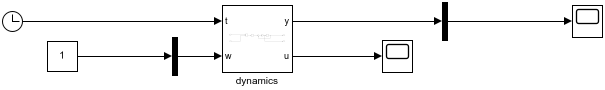

# Simulink Model Scaling

Build multi-agent Simulink models from single agent templates.

## Reference

  flag = SCALE_SIMULINK_MODEL(block_name,N,common_inputs,demux_inputs,mux_outputs)

The currently open model (from GCS) will be used as the template.  A new 
model will be created for the output.  Block 'block_name' will be 
replicated N times.  Inputs listed (by index number) in 'common_inputs'
will all be connected together to the output of a 'gain' block.  Inputs
listed in 'demux_inputs' will be connected to the output ports of a
demultiplexer.  Outputs listed in 'mux_outputs' will be connected to the
input ports of a multiplexer.

Example: SCALE_SIMULINK_BLOCK('dynamics',12,[1],[3],[6]) creates a new
model with 12 copies of the 'dynamics' block from the current system.
A new gain block will be created in the model, feeding into the first
input of every new dynamics block.  A new 12-way demultiplexer block will be
added with each output connected to the third input of its respective
dynamics block.  The sixth output of each dynamics block will be
connected to the corresponding input of a new 12-way multiplexr block.

The 'gain' block is a pass-through placeholder for connecting to a new 
common input.

It is anticipated that this function is used within a larger build script,
which also adds extra blocks and plumbing in the multi-agent simulation.  
Utilities CONNECT_COMMON_INPUT, CONNECT_DEMUX_INPUT and CONNECT_MUX_OUTPUT 
are provided to help make those connections.

## Example

The code below is reproduced from the SCALE_EXAMPLE script provided.

```
% open the single agent system to be used as the template
open_system('single_example')

% make multiple copies of the 'dynamics' block
block_name = 'dynamics';
common_inputs = [1]; % all blocks' input 1 port will connect to a common constant source
demux_inputs = [2]; % each input 2 port will be connected to respective output on a demux
mux_outputs = [1]; % all output 1 ports will be muxed together

scale_simulink_model(block_name,N,common_inputs,demux_inputs,mux_outputs)

% attach a clock to the common input feeding port 1 inputs
clock_name = connect_common_input(1,'simulink/Sources/Clock',1)

% attach a constant to the demux feeding port 2 inputs
const_name = connect_demux_input(2,'simulink/Sources/Constant',1)
set_param([gcs '/' const_name],'Value',mat2str(1:N))

% attach a scope to the mux combining port 1 outputs
scope_name = connect_mux_output(1,'simulink/Sinks/Scope',1)
```
It takes the `single_sxample.slx` file pictured below as its template.



Its immediate output is the model shown below.


This is pretty ugly, but tidies up OK with the auto-arrange tool, found in 
the Simulink Format menu.


